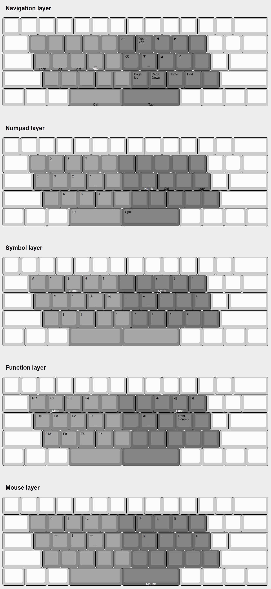
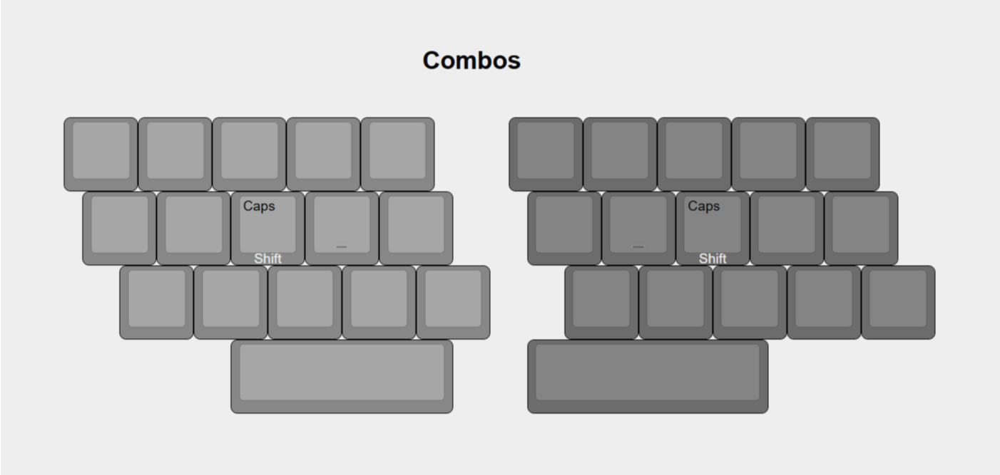
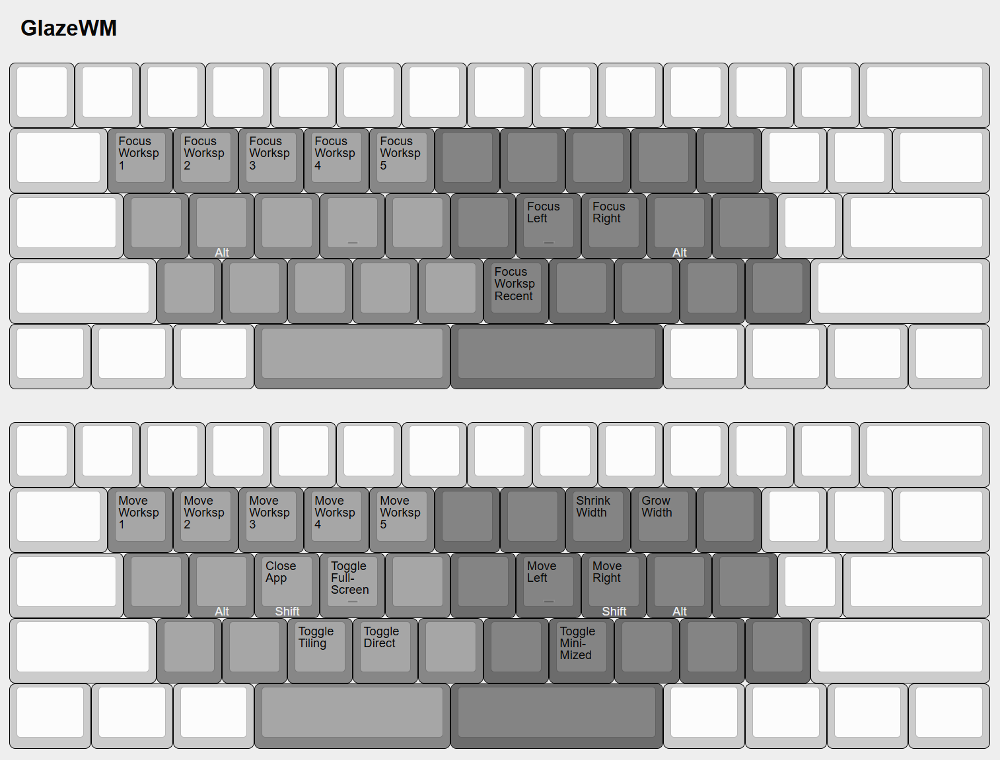
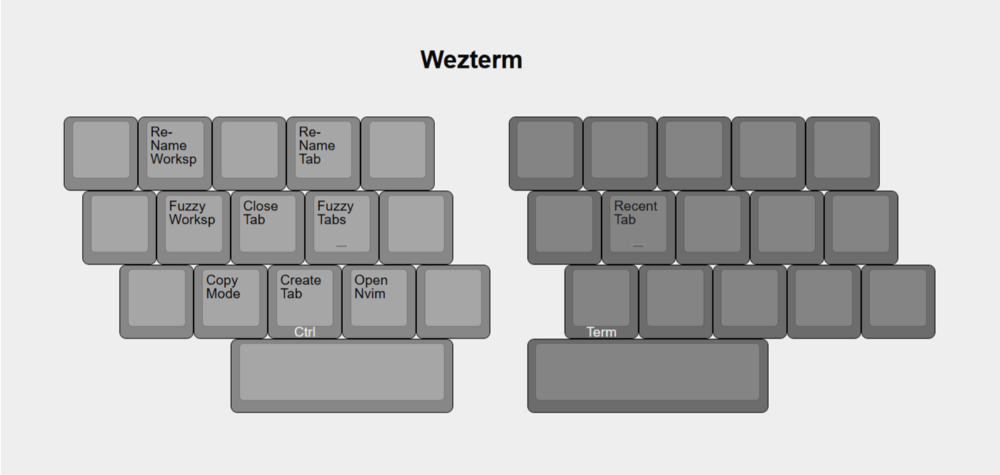

# Keyboard Layout

This is a 32-key keyboard layout designed for standard keyboards  
It is implemented using [Kanata](https://github.com/jtroo/kanata). Full configuration in my [dotfiles repository](https://github.com/darianmorat/dotfiles/blob/main/config/kanata/kanata.kbd)

### Base Layer

### Main Layers

### Combos

### GlazeWM

### Wezterm

