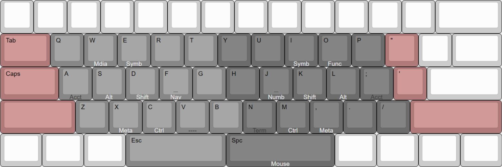
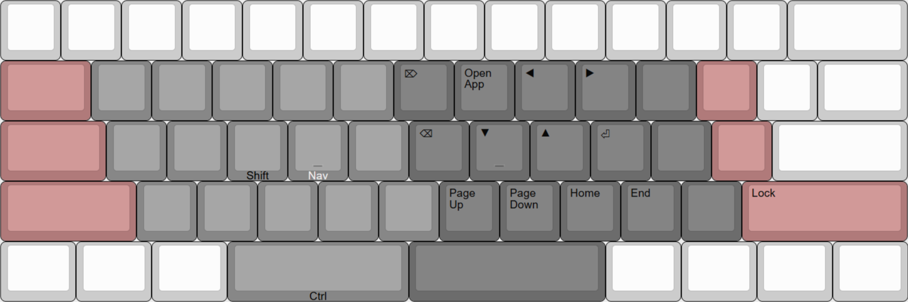
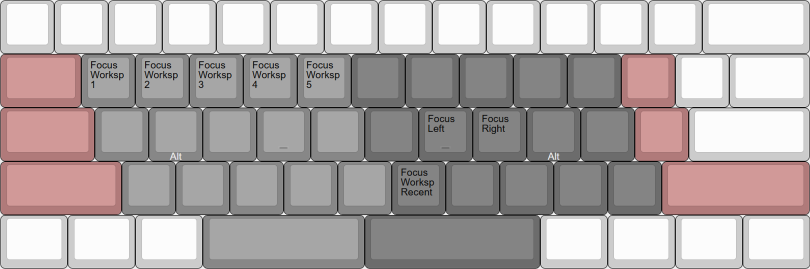
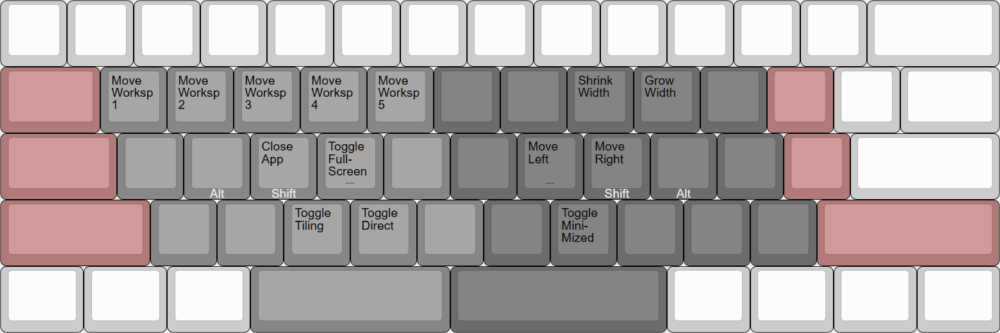
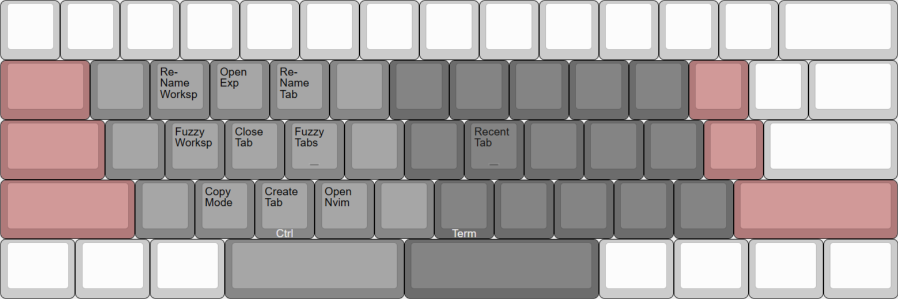

# Keyboard Layout

### Base Layer

   

### Navigation Layer

   

### Numpad Layer

   

### Symbol Layer

   

### Function Layer

   

### Mouse Layer

   

### GlazeWM Layer

   

   

### Terminal Layer

